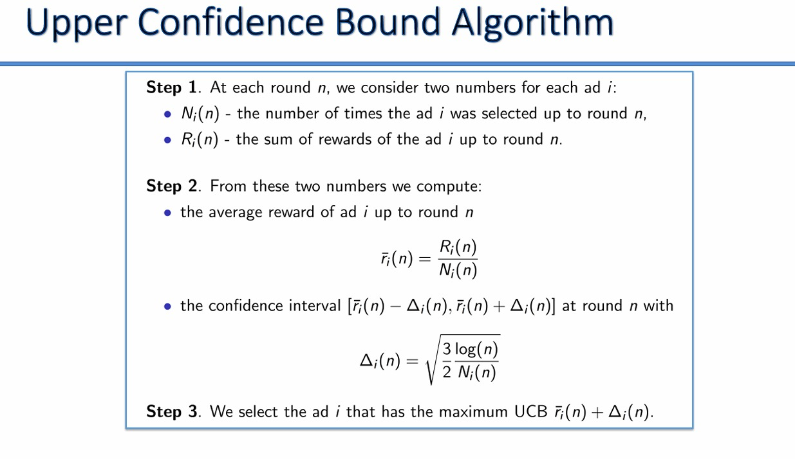
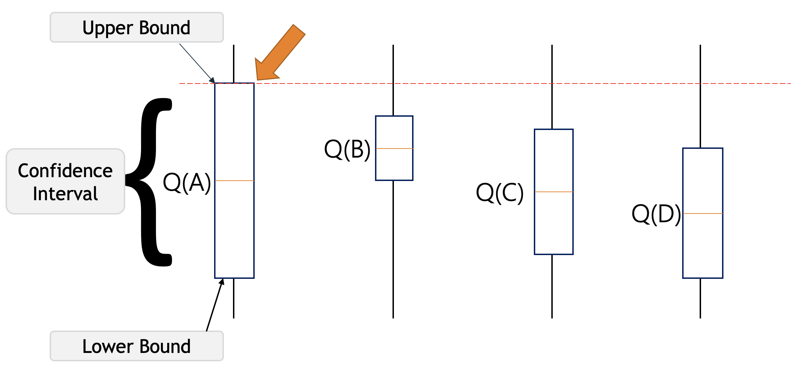

# Reinforcement Learning Project - Upper Confidence Bound (UCB) Algorithm

## Logos


## Objective
I was given the task of optimizing ad selection to maximize click-through rates (CTR) using the Upper Confidence Bound (UCB) algorithm. This project aims to identify the ad with the highest CTR from a dataset of 10,000 users over 10,000 rounds with 10 different ads.

## Developer Information
**Name**: Yuvraj Singh Chowdhary  
**LinkedIn**: [Yuvraj Singh Chowdhary](https://www.linkedin.com/in/yuvraj-singh-chowdhary/)  
**GitHub Repo**: [MarketMaster - Ad Optimization UCB](https://github.com/chowdhary19/MarketMaster-Ad-Optimization-UCB)  
**Reddit**: [SuccessfulStrain9533](https://www.reddit.com/user/SuccessfulStrain9533/)



---

## Overview
In this project, I used the Upper Confidence Bound (UCB) algorithm for reinforcement learning to analyze a dataset containing ad selections by 10,000 users over 10,000 rounds. The goal was to discover which ad had the highest click-through rate.

---

## Dataset
The dataset used in this project is `ads_ctr_optimisation.csv`, which consists of 10,000 rows representing users and their interactions with 10 different ads over 10,000 rounds.

---

## Libraries Used
The following Python libraries were used in this project:

- **numpy**: For numerical operations.
- **pandas**: For data manipulation and analysis.
- **matplotlib**: For data visualization.

---

## Installation
To install the necessary libraries, run the following command:
```bash
!pip install numpy pandas matplotlib
```

---

## Data Preprocessing
The dataset was loaded and prepared for analysis. Each user's interaction with each ad was recorded, and the UCB algorithm was applied to identify the ad with the highest CTR.

```python
import numpy as np
import pandas as pd
import matplotlib.pyplot as plt

# Load the dataset
dataset = pd.read_csv('ads_ctr_optimisation.csv')
```

---

## Upper Confidence Bound (UCB) Algorithm
The UCB algorithm was applied to the preprocessed data to optimize ad selection and identify the ad with the highest CTR.

```python
import math

# Implementing UCB
N = 10000  # Number of rounds
d = 10  # Number of ads
ads_selected = []
numbers_of_selections = [0] * d
sums_of_rewards = [0] * d
total_reward = 0

for n in range(0, N):
    ad = 0
    max_upper_bound = 0
    for i in range(0, d):
        if (numbers_of_selections[i] > 0):
            average_reward = sums_of_rewards[i] / numbers_of_selections[i]
            delta_i = math.sqrt(3/2 * math.log(n + 1) / numbers_of_selections[i])
            upper_bound = average_reward + delta_i
        else:
            upper_bound = 1e400
        if upper_bound > max_upper_bound:
            max_upper_bound = upper_bound
            ad = i
    ads_selected.append(ad)
    numbers_of_selections[ad] += 1
    reward = dataset.values[n, ad]
    sums_of_rewards[ad] += reward
    total_reward += reward
```

---

## Inspecting the Results
The results of the UCB algorithm were inspected to identify the ad with the highest click-through rate.

```python
# Visualizing the results
plt.hist(ads_selected)
plt.title('Histogram of ads selections')
plt.xlabel('Ads')
plt.ylabel('Number of times each ad was selected')
plt.show()
```

---

## Key Findings
From the analysis, it was discovered that ad 4 had the highest click-through rate. This insight can be used to prioritize the display of ad 4 to maximize engagement.

---

## Instructions for Collaborators and Users
1. **Modify Data Preprocessing**: Adapt the data preprocessing phase to fit your business dataset. Ensure that each user's interaction with each ad is correctly recorded.
2. **Adjust UCB Parameters**: Depending on your business requirements, you might need to adjust the parameters of the UCB algorithm to suit your specific needs.
3. **Analyze Results**: Use the provided code to inspect the results and identify the ad with the highest CTR.

---

## Example Adjustments
- **Data Preprocessing**: If your dataset has a different structure, modify the preprocessing code to correctly format your data.
- **UCB Parameters**: Adjust the number of rounds (N) and the number of ads (d) to fit your specific scenario.

---

## Conclusion
This project demonstrates how to use the Upper Confidence Bound (UCB) algorithm for ad optimization. By identifying the ad with the highest click-through rate, businesses can make informed decisions to enhance their marketing strategies.

---

## The Dataset and the full source code have been deployed in the GitHub repository. Looking forward to positive collaborations.

---




---

## Reference Documentation
- [Reinforcement Learning](https://en.wikipedia.org/wiki/Reinforcement_learning)
- [Upper Confidence Bound](https://en.wikipedia.org/wiki/Upper_confidence_bound)

---

This README includes detailed instructions and insights for implementing the Upper Confidence Bound algorithm to optimize ad selection. Modify and adapt the code to fit your specific business needs and data structures.
